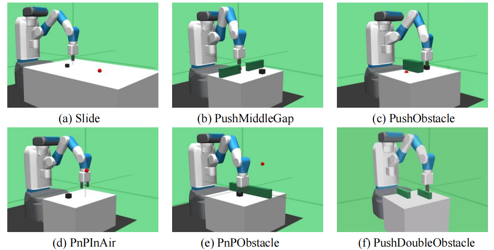

# Goal-Conditioned Exploration Framework

This repo is established for goal-conditioned exploration in multi-goal robotic environments.
We provide a modular framework on which users can easily modify and expand their own algorithms.

## Requirements
- gym==0.15.4

- mpi4py==3.1.3

- torch==1.8.1+cu111

- mujoco-py==2.1.2.14

- wandb==0.13.10

## Main Module

### Goal Teacher
Many algorithms set intrinsic goals to help robot to exploration in hard-exploraion environments. This module contains the goal selecting algorithms.
- Supported Algorithms
    - [HGG](https://arxiv.org/abs/1906.04279)  (rl_modules/teachers/HGG) 
    - [VDS](https://arxiv.org/abs/2006.09641) (rl_modules/teachers/VDS)
    - [MEGA](https://arxiv.org/abs/2007.02832)(rl_modules/teahcers/AGE)
    - [RIG](https://arxiv.org/abs/1807.04742) (rl_modules/teachers/AGE)
    - [MinQ](https://arxiv.org/abs/1907.08225) (rl_modules/teachers/AGE)
    - [AIM](https://arxiv.org/abs/2105.13345) (rl_modules/teachers/AIM)

The AGE(Active Goal Exploration) module contains different goal sampling stratagies, please see [ageteacher.py](https://github.com/poisonwine/Goal-Conditioned-Exploration/blob/master/rl_modules/teachers/AGE/ageteacher.py) for detailed information.

### Reward Teacher
Use intrinsic reward to score goals or help robot learning.
 - Supported Algorithms
    - [MINE](https://arxiv.org/abs/2103.08107)  (rl_modules/teachers/MINE) 
    - [RND](https://arxiv.org/abs/1810.12894) (rl_modules/teachers/RND)
    - [ICM](https://arxiv.org/abs/1705.05363)(rl_modules/teahcers/ICM)

### Algorithm
We implement three common reinforment learning  algorithms in robot learning, including DDPG、 TD3 and SAC. Besides, we implement three types of critic network architecture, including [monolithic](https://github.com/poisonwine/Goal-Conditioned-Exploration/blob/master/rl_modules/models.py)、[BVN](https://arxiv.org/abs/2204.13695) and [MRN](https://arxiv.org/abs/2208.08133).

### Envs
Our repo contains plenty of  goal-conditioned robot envs, please see [myenvs](https://github.com/poisonwine/Goal-Conditioned-Exploration/tree/master/myenvs/__init__.py). 

There are six most difficult envs where  the desired goals and block initial position have a huge gap, as the following figure shows.

### Other Supported Algorithms
Transition selecting
- [CHER](https://dl.acm.org/doi/10.5555/3454287.3455418)
- [MEP](https://arxiv.org/abs/1905.08786v1)
- [EB-HER]

## How to use

All parameters is 